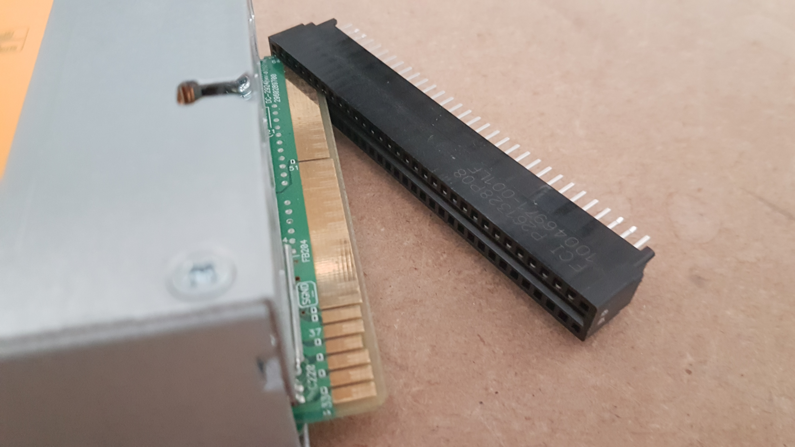
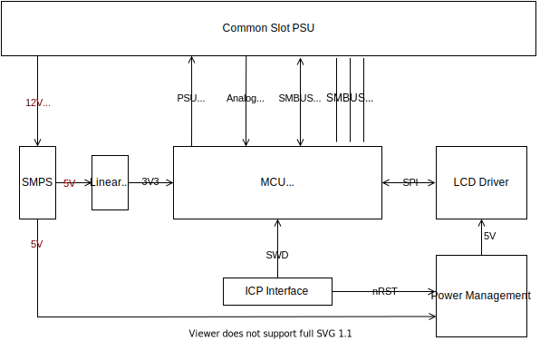
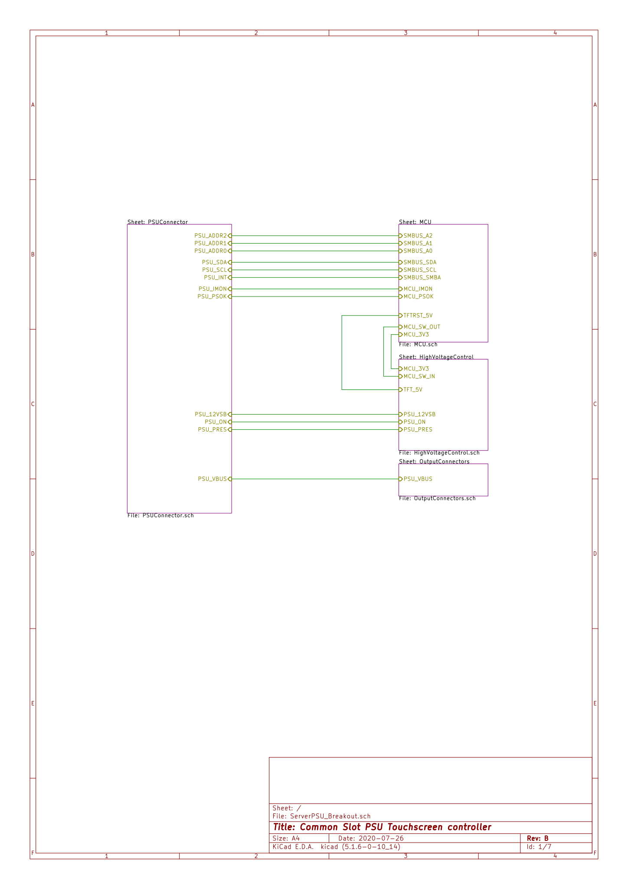
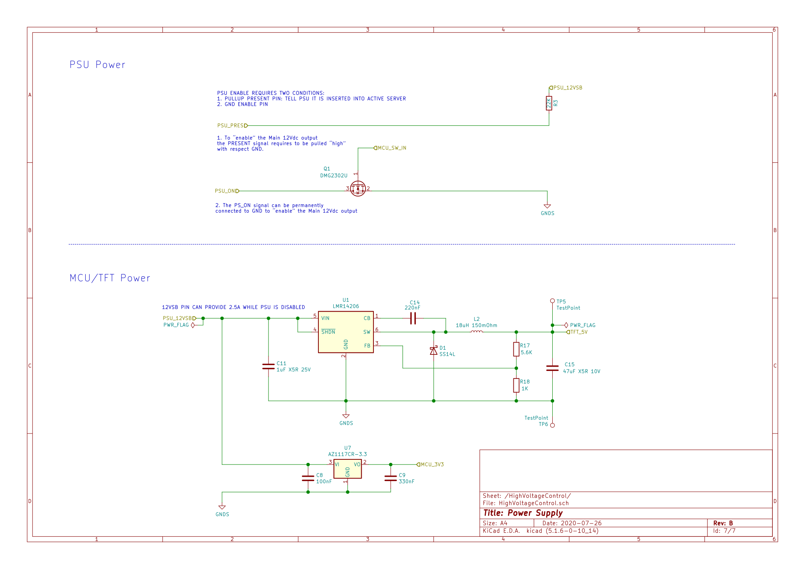
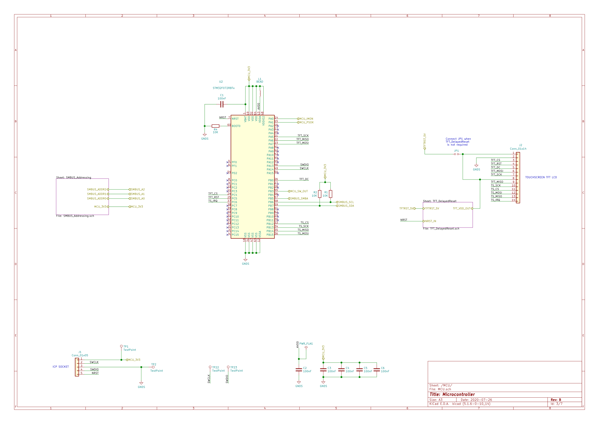
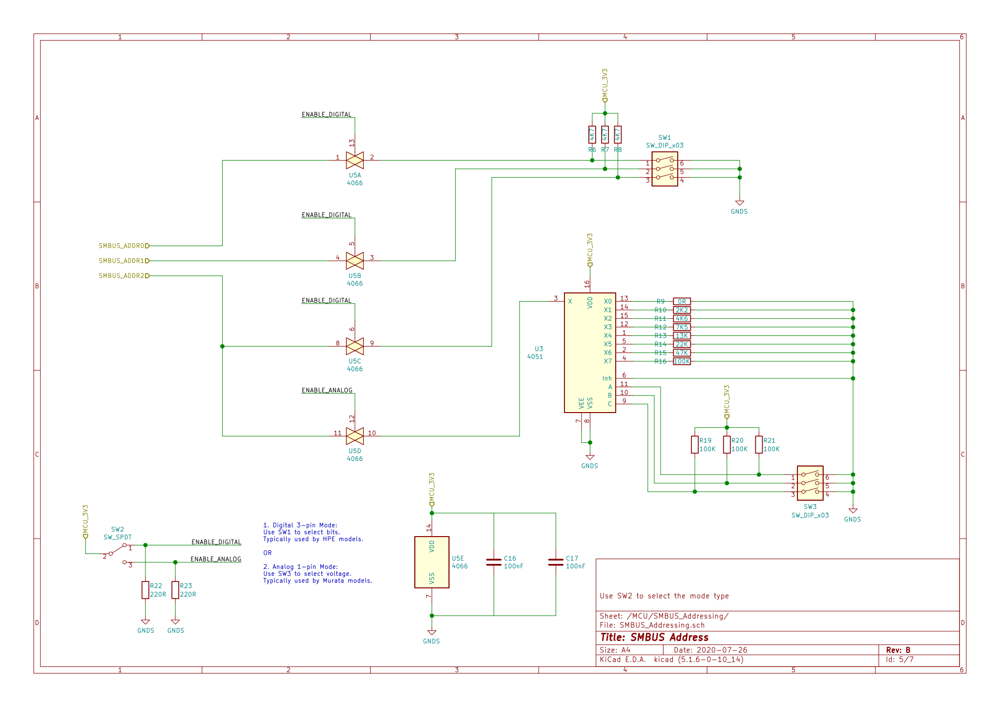

## TouchScreen Controller for 'CommonSlot' Server PSU

- Required Kicad Hardware library: https://github.com/cracked-machine/KicadLibrary
- Related SW Project: https://github.com/cracked-machine/CommonSlotPSU_TouchScreenController_SW

This project repurposes the power supply units (PSU) found in datacentre servers. The PSU are very powerful (12V @ 600W), efficient and compact.
They are useful for charging LIPO batteries (with some modification) and running brushless motors or any circuit that draws large amounts of current.
These PSU are replaced in industry on a regular basis - often well before their end-of-life - and can be found for a very reasonable price on the second hand market (ebay). This has been further aided by the rise (and decline) of the bitcoin "boom" a few years back.

The purpose of this project is to use a touch screen to control the server PSU. In turn the touchscreen will display information from the PSU including its status, voltage, current and other data via SMBUS protocol.

The touch screen is mounted on a PCB that connects to the server PSU via its "common slot" connector. This is a 64-pin card slot connector as shown below:

Information regarding specific PSU models can be hard to find. However, the design seems to be an unofficial standard across different manufacturers (HP, Murata, etc...). Some datasheets [[1]](#References), application notes [[2]](#References) and schematics [[3]](#References) for similar models have been used to successfully glean relevant information. They will be referenced frequently throughout this page.

### System Overview

The controller board takes a 12VDC supply from the PSU (from the 12VSB card slot pin #37) and is booted as soon as the PSU is connected to the mains supply. This pin can supply 3A [[1]](#References) which is more than enough current to run the MCU and its LCD display.

A more detailed view of the interconnections between the high level system blocks are shown in the schematic page below.

### SMPS and PSU Output Enable block

The 12VSB rail is stepped down to 5V using a Texas Instruments [LMR14206 "Simple Switcher"](https://www.ti.com/lit/ds/symlink/lmr14206.pdf). This provides 0.6A at 84% efficiency with 0.5mV output ripple [[4]](#References). For the higher current requirements of the OLED screen, a SMPS solution is preferable over the power disspiation that would be caused by a linear regulator (4.2W).

The 12VSB output is stepped down to 3V3 to supply the MCU. Since the MCU only draws 0.025A, the subsequent power disspation from the regulator - with copper pour heatsink - is acceptable (0.2W).

The PSU has insertion detection (using the PRESENT card slot pin #36). This alerts the PSU that it has been inserted into the back of a server housing. To enable this we simply connect this to 12VSB card slot pin #37 via a 22K resistor. With this in place we can enable the PSU output by pulling the PSON (card slot pin #33) to ground using an external NMOS. The gate of this NMOS is controlled by the MCU.

### Microcontroller block

The main requuirements for the MCU is SPI peripheral for the LCD display and I2C/SMBUS periperiphal for SMBUS communication. The STM32F072VB fullfills both these requirements and is also a small footprint (QFP64) and low cost (~£1).

SWD is used to provide in-circuit programming. The advanced speeds of JTAG are not required for this application.

### SMBUS Addressing

This is based on two schemes:

- HP 8bit addressing scheme using pins #27, #28 and #29. See [[3]](#References)
- Murata analog addressing scheme using resistance to ground. Pin #27 only. See [[2]](#References)

A single pole, double throw switch (SW2) is used to select the active address scheme.
A DIP switch (SW1) is used to select the bits of the address word in the HP scheme.
A DIP switch (SW3) is used to select the value of the address signal in the Murata scheme.

### Power Management block

When running a debug session (using SWD via the ICP interface) the NRST pin of the SWD cable is used to reset the MCU before downloading the binary file. However, this reset signal is not sufficient to fully reset the LCD Driver IC [TSC2046](https://www.ti.com/lit/ds/symlink/tsc2046.pdf). As such the LCD screen would only initialise when the entire system was power cycled, and would freeze during debug under reset.
After inspecting the signals on the LCD driver and the MCU it became apparent that a pulse extender was required to hold the TSC2046 in reset while the MCU re-initialized. The solution chosen was to use a timer IC [MIC1555](http://ww1.microchip.com/downloads/en/DeviceDoc/mic1555.pdf) to extend the pulse and a MOSFET driver IC to provide a current source for the LCD and driver.
The active low pulse was extended from 300ns [[5]](#References) to 1sec. Note, NRST is an active low signal and the MIC1555 timer outputs a positive-going signal. So the [MCP1415](http://ww1.microchip.com/downloads/en/DeviceDoc/20002092G.pdf) - which has an inverted output - was chosen.

The circuit design is shown below:

### References

1. [Datasheet: D1U86P-W-1600-12-HBxDC Series 86mm 1U Front End AC-DC Power Supply](RevB/docs/Murata_HP_datasheet_appnotes/d1u86p-w-1600-12-hbxdc.pdf)
2. [Application Note for D1U86P-12 Interface Connector Card](RevB/docs/Murata_HP_datasheet_appnotes/acan-50.pdf)
3. [HP_HSTNS-PL11_PS-2122-1C schematic](RevB/docs/Murata_HP_datasheet_appnotes/HP_HSTNS-PL11_PS-2122-1C.pdf)
4. [LMR14206 Webench design specs](RevB/docs/systemdesign/LMR14206_12V_to_5V_0.6A.csv)
5. [STM32F072VB Datasheet](https://www.st.com/resource/en/datasheet/stm32f072vb.pdf)
